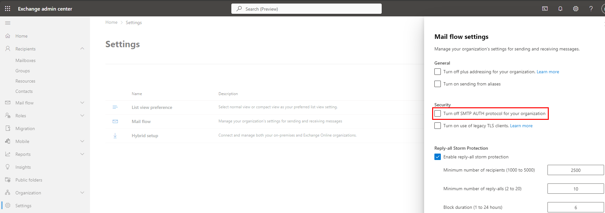
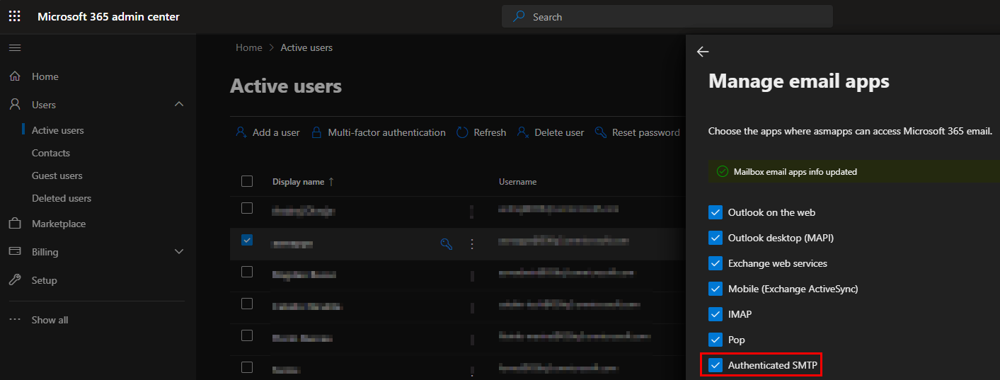
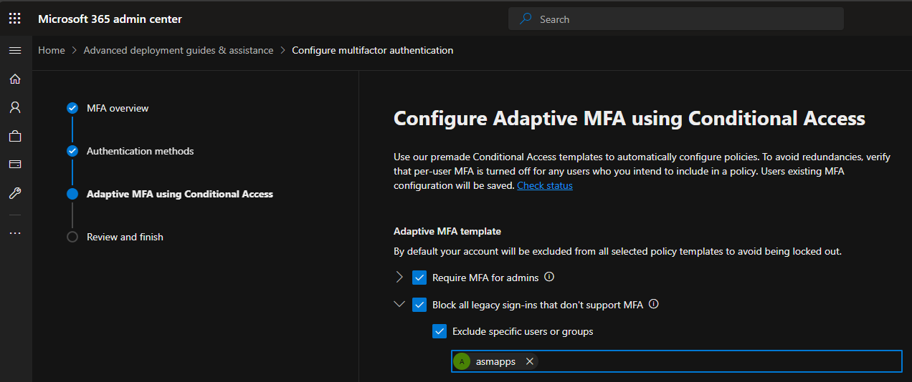

# Configure Nodemailer with Microsoft 365

Sample nodemailer script to send emails using a Microsoft365 (Exchange Online) mailbox.

## Steps

1. From [Exchange Admin Center](https://admin.exchange.microsoft.com/#/mailboxes) -> [Settings](https://admin.exchange.microsoft.com/#/settings) -> Mail flow -> Turn Off SMTP AUTH protocol for your organization (untick)
   
2. From [Microsoft 365 Admin Center](https://admin.microsoft.com/Adminportal/Home#/users) -> mailbox -> Mail tab -> enable Authenticated SMTP
   
3. From [Microsoft 365 Admin Center](https://admin.microsoft.com/Adminportal/Home#/users) -> [Multi Factor Authentication](https://admin.microsoft.com/adminportal/home?Q=m365activeusers#/featureexplorer/security/ConditionalAccess) -> disable MFA for the user
   
4. Create the nodemailer transporter:

```js
const transporter = nodemailer.createTransport({
	service: "Outlook365",
	auth: {
		user: "user@domain.com",
		pass: "password",
	},
});
```

5. Run with credentials: `node --env-file .env email.js`
